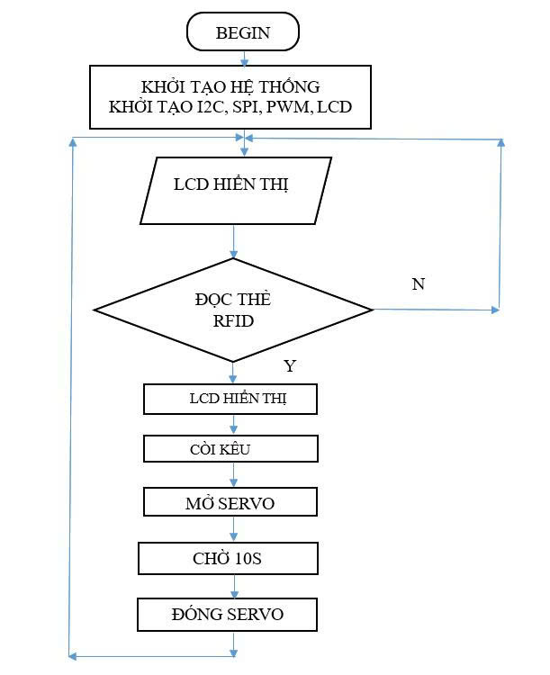
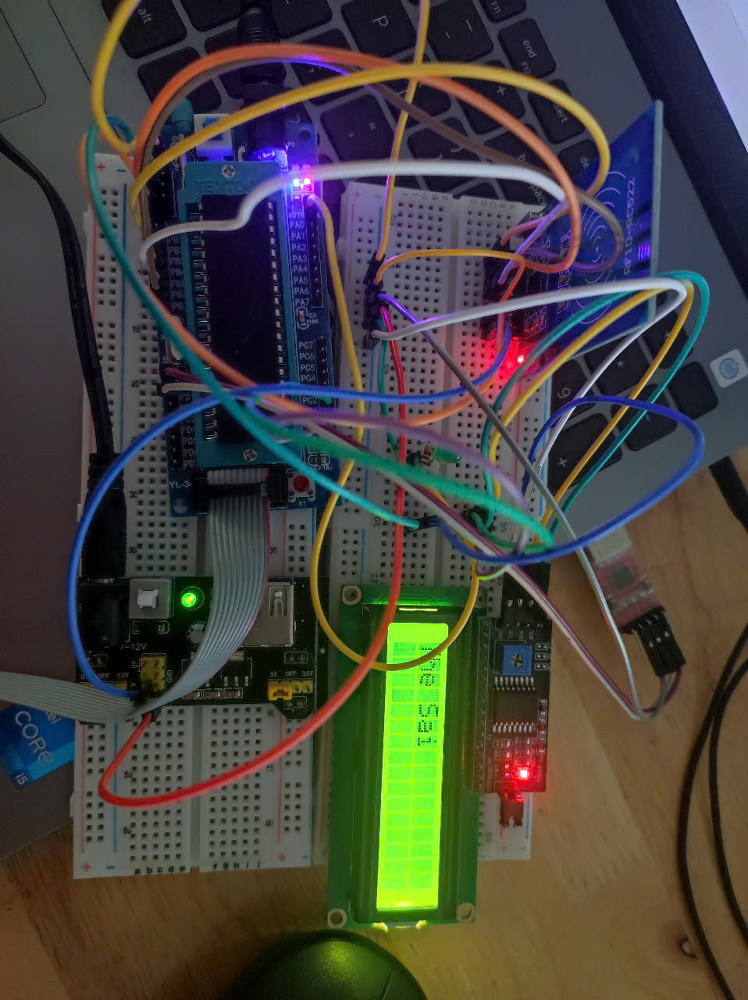
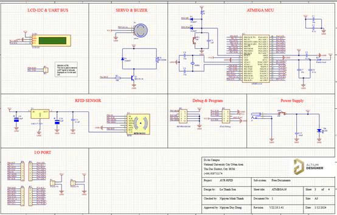
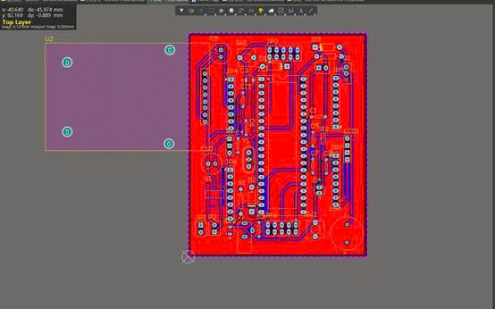

# RFID Shield – Access Control System  

## 📌 Introduction  
This project implements an **RFID-based security gate system** using an **ATmega16 microcontroller**.  
The system authenticates access with RFID cards, controls a servo motor to open/close a barrier, displays user feedback via an LCD and buzzer, and transmits card UID via UART.  

---

## 🔧 Features  
- **RFID Authentication**: Detects and reads UID from RFID cards (MFRC522 via SPI).  
- **Servo Control**: Opens the barrier (90°) for 10 seconds, then closes automatically.  
- **LCD Display**: Shows status messages such as “Mời quét thẻ” and “Mời ra”.  
- **Buzzer Notification**: Sounds when a valid card is scanned.  
- **UART Communication**: Sends UID to external systems for logging.  
- **Low-cost & compact**: Operates on 5–12V, cost under 400k VND, lightweight (< 1kg).  

---

## 📐 System Diagram  
  

---

## 📊 Results & Evaluation  
  

- The system operated stably during test runs.  
- Issue: Servo control instability due to PWM signal noise.  
- Solution: Improve PCB layout, use genuine components, and add decoupling capacitors to reduce noise.  

---

## 📸 Demo  

### 🔹 Schematic  
  

### 🔹 PCB Layout  
  

---

## 👨‍💻 Authors  
- Nguyễn Minh Thành  
- Nguyễn Duy Đông  
- Lê Thanh Sơn  

---

## 📫 Contact  
✉️ Email: **nguyenminhthanh.office@gmail.com**
